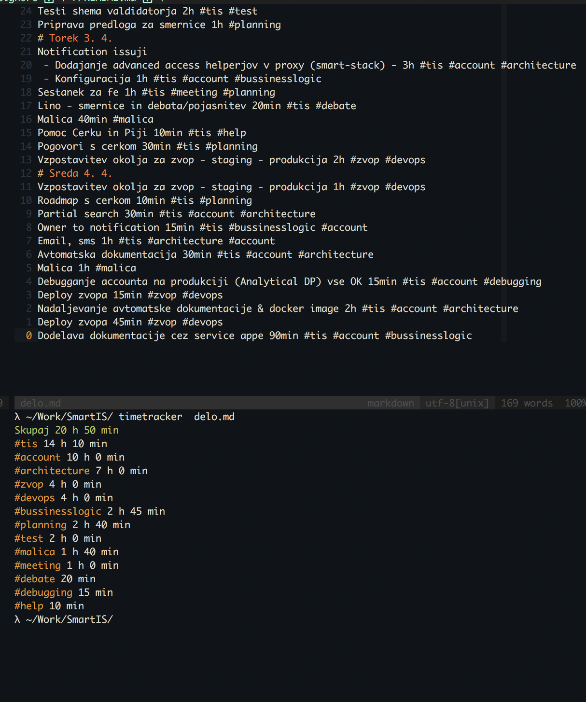

# Kaj
Paket, ki nam olajsa trackanje ur in nam pomaga ugotoviti
zakaj porabimo svoj cas

# Kako
Enostavno, za posamezen mesec, ali obdobje, ki ga zelimo trackati naredimo
datoteko z naslednjimi pravili:
* Vrstica, ki se zacne z **#** je komentar
* Ce se v vrstici pojavi (najvec enkrat) **<stevilo>h** ali **<stevilo>min**
* V vrstici je lahko poljubno stevilo hashtagov (ne na zacetku) **#<tag>**, ki nam pomagajo pri kategorizaciji

# Instalacija in zagon
```bash
# Instalacija
$ npm install --global git+https://git.smartis.si/kkogovsek/timetracker.git
# Zagon
$ timetracker ./pot/do/datoteke
```

#Demo time

